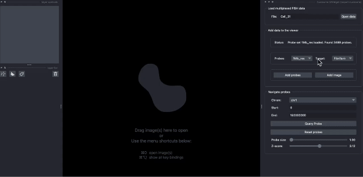

Welcome to Napari-nucleome tutorial!
===================================

Advances in whole-genome mapping techniques have facilitated the characterization of 3D chromatin organization inside the cell nucleus with unprecedented throughput and resolution. Multiplexed imaging-based methods, on the other hand, provide a direct readout of the 3D spatial position of hundreds of chromatin probes at a single-cell scale with additional imaging of RNA and other subnuclear structures. However, there is a major gap in fully utilizing the complementarity of these different data modalities for effective visualization.

The |nb-link| plugin will, for the first time, allow users of napari to perform interactive exploration of multi-modal datasets, including imaging, multi-omics and 3D genome structure models for studying the cell nucleus.

.. |nb-link| raw:: html

   <a href="https://github.com/zocean/napari-nucleome">napari-nucleome</a>

The following demo will show you how to use the plugin to visualize the multiplexed imaging data in the same napari viewer.

   A example of loading and visualizing the multiplexed imaging data in the same napari viewer.

.. note::

   This project is under active development.

Contents
--------

.. toctree::

   usage
